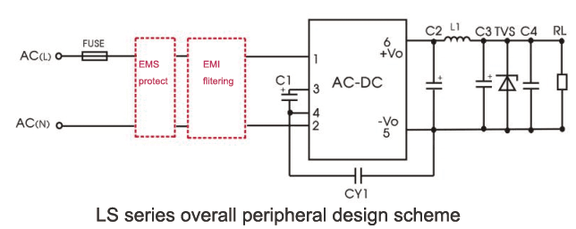

Professional Smart Plugs
16A 250V MAX Power
4 Sockets (16A Total Load)
ESP32 Wi-Fi/Bluetooth S3
5V Relay Coils 
PSU: Hi-Link HLK-5LS05 (5W) 5V DC, 6 Pins -> 2 for AC Input, 2 for DC Output, 2 Vcaps (-, +)

